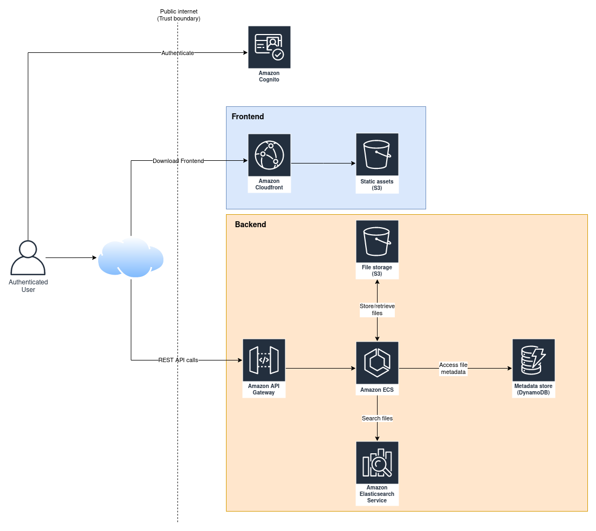
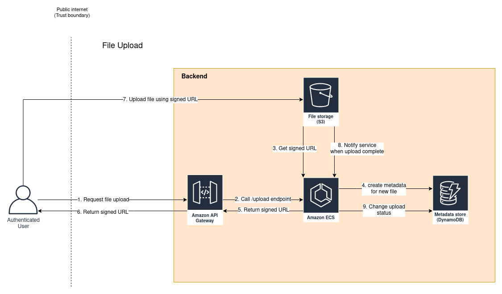

## Serverless Cloud

This project is a demo/learning project to advance my knowledge in AWS and architecting.

Serverless cloud is a self-hosted file storage solution, similar to [Nextcloud](https://nextcloud.com) and [Owncloud](https://owncloud.com/).

Main functionality:
- Upload files securely to the storage
- Download files from the storage 
- View all the files and folders on a web-based frontend
- Share files with other users, create shareable links
- Search uploaded files

Goals:
- Unlimited file storage
- Infinite scalability
- Secure file storage with multiple users
- Completely serverless solution
- Easy deploy with CDK

Not goals:
- Making it platform independent: my solution will be very much AWS specific

### Architecture

Main components:
- Static Assets (S3): Stores the web application frontend assets
- Metadata store: Stores metadata information about the uploaded files
- Amazon ECS: This is the serverless ECS/Fargate service that handles API requests
- File Storage (S3): S3 bucket to store the uploaded files
- Elasticsearch: used for searching in file metadata

### File upload

The following diagram illustrates the file upload data flow:

